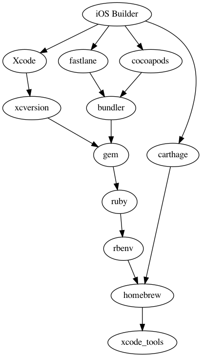

# iOS Build server set up.

## Ansible set up.

To install Ansible run `pip install ansible`. This ansible script has 2
dependencies:

* community.general
* elliotweiser.osx-command-line-tools

To install run `ansible-galaxy collection install community.general` and
`ansible-galaxy install elliotweiser.osx-command-line-tools`.

Then, edit your `/etc/ansible/hosts` and add these lines

```
[ios_builders]
XXX.XXX.XXX.XXX
YYY.YYY.YYY.YYY
[ios_builders:vars]
ansible_connection=ssh
ansible_user=<username>
ansible_ssh_pass=<password>
ansible_become_method=sudo
ansible_become_pass=<password>
```

Now you can execute the script using:

`ansible-playbook setup.yml`



## Homebrew

First, we need to install `homebrew`. This is done via the role `brew`.

It is done via the recommended brew install script. However, there is a catch.
Since the Homebrew install script should not run as root. But use interactive
sudo to make root changes. We first need to add the current user to
`/etc/sudoers` to run the script in a non interactive shell.

## Ruby

To manage different versions of ruby we install rbenv via Homebrew. This also
makes sure that our gems are installed without sudo.

## Gem

We have 4 gems that should be able to be accessed globally:

* bundler
* fastlane
* cocoapods
* xcode-install


The rest should preferably be installed in the repository using bundler.

## xcode-install

Xcode-install is a gem to manage multiple versions of Xcode simultaneously.
There will always be an "active" selected version of Xcode. Xcode-install
downloads the Xcode installations in the `/Applications/` folder with the
format `/Applications/Xcode-XX.X.app` and symlinks the current active Xcode
Version to `/Applications/Xcode.app`. It also manages the active version of
the developer tools. To check the current active version run
`xcversion selected`.


It's also good to know about the tools `xcode-select` and `xcodebuild`. Those
are the Apple native tools that `xcode-install` uses internally.


`xcversion` can be run locally using fastlane without globally switching the
current Xcode version. In the `Fastfile` just add `xcversion(version: "11.6")`
in the `before_all` block.
